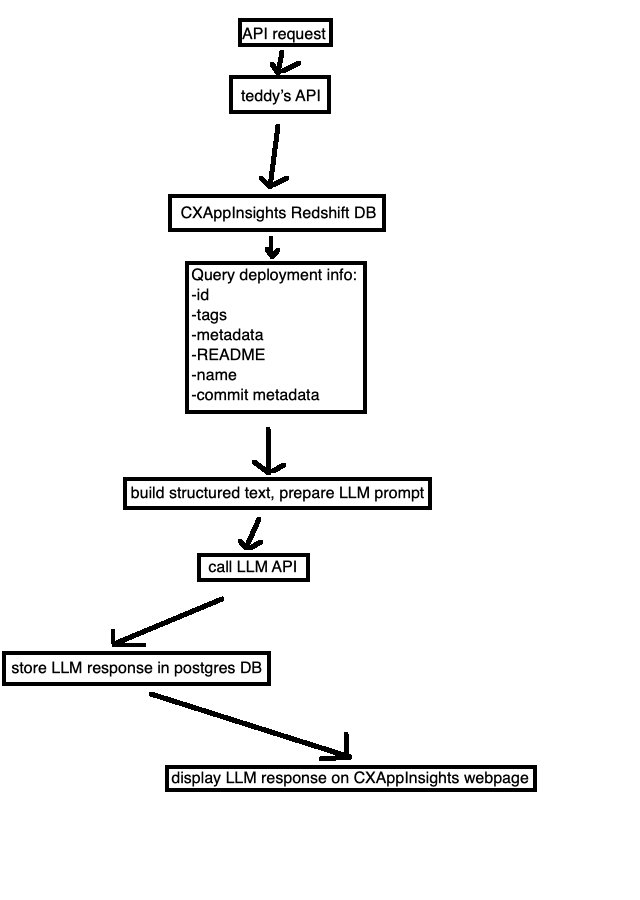

# my-api

This is a simple test enviornment for an API. The API works using FastAPI and uvicorn. When the API is called, simply attach this argument: /summarize/\<deploymentID\>. Here is the order of operations: The API will go into a dummy database folder titled 'DUMMYDB', and look for the text file that corresponds with the \<deploymentID\> argument. It will then grab all the information from this text file (id, name, tags, language, team, latest_commit, repo_path), and format it into an LLM readable prompt (along with some predefined LLM instructions). This prompt will then be sent to an LLM API (not implemented yet), and will listen for a response. Once it recieves the response, it will store the response in a local postgres DB. The column headers for this postgres table are: 'id', 'summary' and 'created_at'. 

Assuming postgres is installed and the table is called `testdb`, you can view the table by:
```
psql testdb
SELECT * FROM deployments;
```
To exit postgres CLI:
```
\q
```

## Run on Your Machine:
Assuming you have installed everything in `requirements.txt`, you can simply run:
```
uvicorn app.main:app --reload
```
The CLI will output an IP address that is on port 8000. Paste this link into your web browser and add `/summarize/\<deploymentID\>` (replace \<deploymentID\> with the name of your dummy deployment txt file).

If your dummy database is set up correctly, and you have a valid postgres database on your machine, everything should run perfect.


## File Structure:
```
my-api/
├── app/
│   ├── main.py              # FastAPI app
│   ├── db_redshift.py       # Redshift DB client
│   ├── db_postgres.py       # Postgres client for storing results
│   ├── git_reader.py        # Pulls README, commits, etc.
│   ├── llm_client.py        # Sends structured prompt to LLM
│   ├── prompt_builder.py    # Merges everything into prompt
│   ├── models.py            # not implemented yet
├── tests/                   # Unit tests (not implemented yet)
├── .env                     # DB credentials, API tokens (not implemented yet)
├── requirements.txt
├── README.md
```

## API Diagram:
